MANUEL D’UTILISATION – ARBRE32 (Stack Dockerisé)
1. Présentation du stack technique

L’application Arbre32 est déployée sous forme d’un stack Docker multi-conteneurs, garantissant :

Portabilité

Reproductibilité

Séparation claire des responsabilités

## DEPLOIMENT

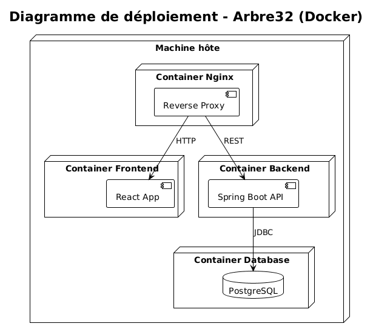

Stack utilisé
Composant	Technologie
Frontend	React + Vite
Backend API	Spring Boot
Moteur de jeu	Module Java (Core)
Base de données	PostgreSQL
Orchestration	Docker Compose

2. Prérequis

Avant de lancer l’application, l’utilisateur doit avoir :

Docker ≥ 20.x

Docker Compose ≥ v2

Un navigateur web récent (Chrome, Firefox, Edge)

Vérification :

docker --version
docker compose version

3. Installation et lancement de l’application
   3.1 Récupération du projet
   git clone https://github.com/pozisyon/groupe23.git
   cd groupe23

3.2 Lancement du stack Docker

À la racine du projet :

docker compose up --build

 Cette commande :

Compile le backend

Lance la base PostgreSQL

Démarre l’API

Démarre le frontend

Connecte tous les services sur un réseau Docker commun

3.3 Services exposés
Service	URL
Frontend	http://localhost:8080 car il est servi par spring
API REST	http://localhost:8080

WebSocket	ws://localhost:8080/ws
PostgreSQL	localhost:5432

## Architecture globale

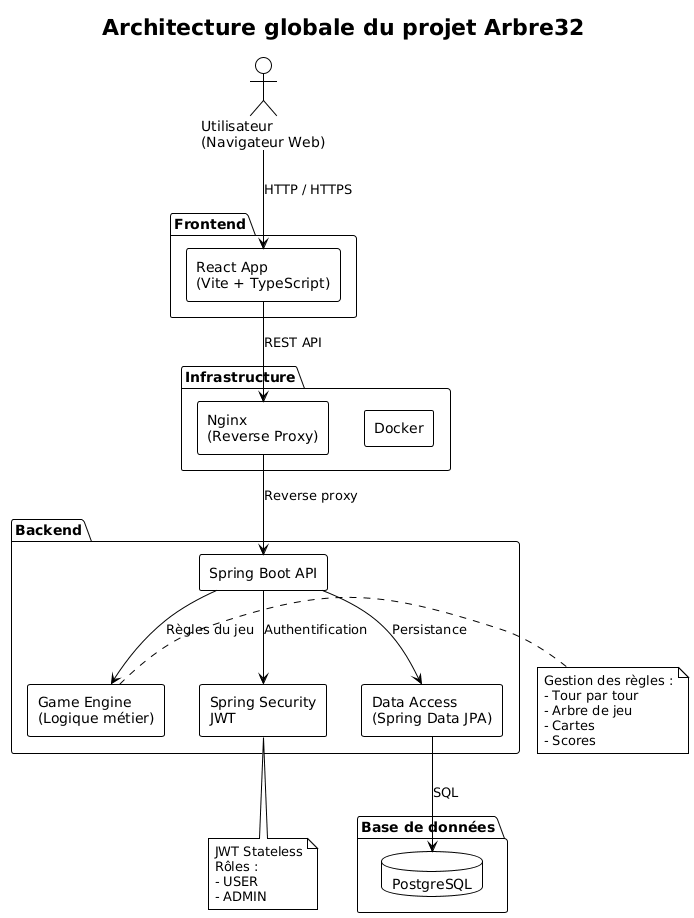

## Diagramme de classe
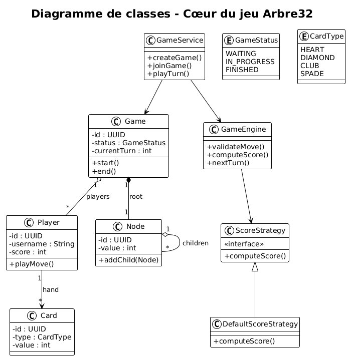

## LIENS DES EVENT FRONTEND A BACKEND

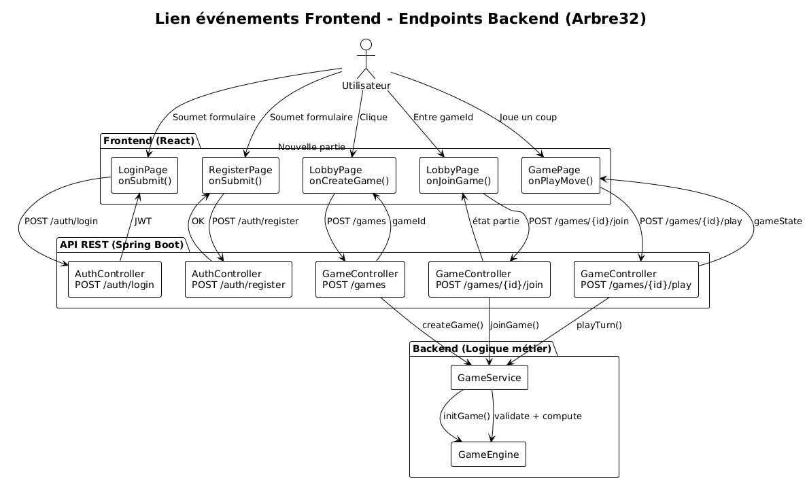

4. Utilisation de l’application (Utilisateur)
## CREER UNE PARTIE
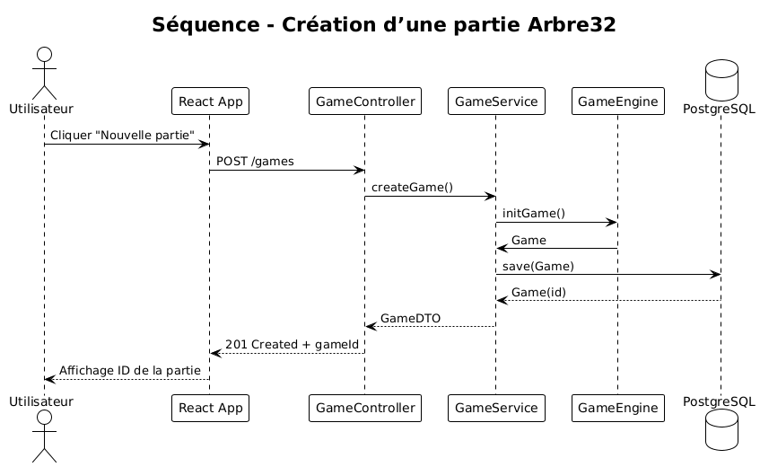

Accéder à l’interface web

Cliquer sur Créer un compte

Renseigner :

Email

Handle (pseudo)

Mot de passe

Valider

4.2 Connexion

Accéder à la page Connexion

Entrer email + mot de passe

L’utilisateur est redirigé automatiquement :

vers le Lobby (utilisateur normal)

ou vers le Dashboard Admin (administrateur)

## CREER UNE PARTIE

4.3 Rejoindre une partie

Depuis le lobby :

Créer une nouvelle partie

Rejoindre une partie existante

Attendre un adversaire

4.Jouer une partie
## JOUER UN TOUR
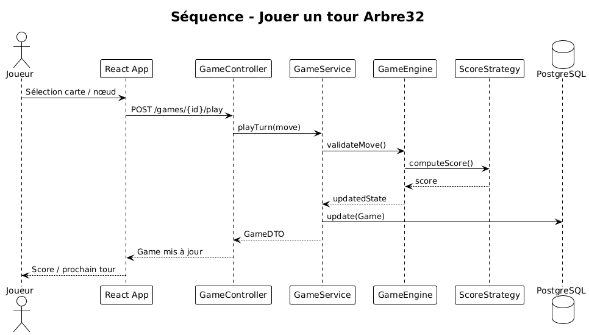

Le plateau affiche l’arbre de cartes

Les cartes jouables sont mises en évidence

Le joueur sélectionne une carte à son tour

Les points sont calculés automatiquement

Les messages système s’affichent dans le chat

4.5 Fin de manche et fin de match

Une manche se termine lorsqu’aucun coup n’est possible

Le score de la manche est attribué

Le match est gagné lorsqu’un joueur remporte 2 manches sur 3

Le gagnant est affiché à l’écran

5. Utilisation de l’application (Administrateur)
   5.1 Accès à l’espace administrateur

Un compte avec rôle ADMIN est redirigé automatiquement vers :

/admin

6. Patterns de conception utilisés (GoF)

## PATRON CE CONCEPTION
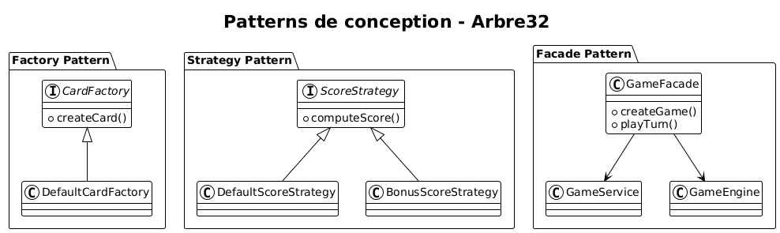

6.1 Factory Pattern

Utilisation :

Création des cartes

Création des nœuds de l’arbre

Avantage :

Centralise la logique de création

Facilite l’extension du jeu

public interface CardFactory {
Card createCard(CardType type);
}

6.2 Strategy Pattern

Utilisation :

Calcul des scores

Règles de jeu variables

Avantage :

Permet de changer les règles sans modifier le cœur du jeu

public interface ScoreStrategy {
int computeScore(GameState state);
}

6.3 Facade Pattern

Utilisation :

Accès simplifié aux fonctionnalités complexes du moteur de jeu

Avantage :

Réduit le couplage

Simplifie l’utilisation côté contrôleurs

public class GameFacade {
public void playTurn(...) { }
}

7. Arrêt de l’application

Pour arrêter proprement le stack :

docker compose down

Pour supprimer aussi les volumes (base de données) :

docker compose down -v

7. Avantages du déploiement Docker

Aucun prérequis Java / Node côté utilisateur

Environnement identique pour tous

Déploiement simple sur serveur ou cloud

Séparation claire :

frontend

backend

base de données

8. Conclusion

L’utilisation de Docker dans Arbre32 permet :

Une prise en main rapide

Un déploiement fiable

Une architecture professionnelle

Une conformité avec les bonnes pratiques DevOps

## CPATURES D'ECRAN
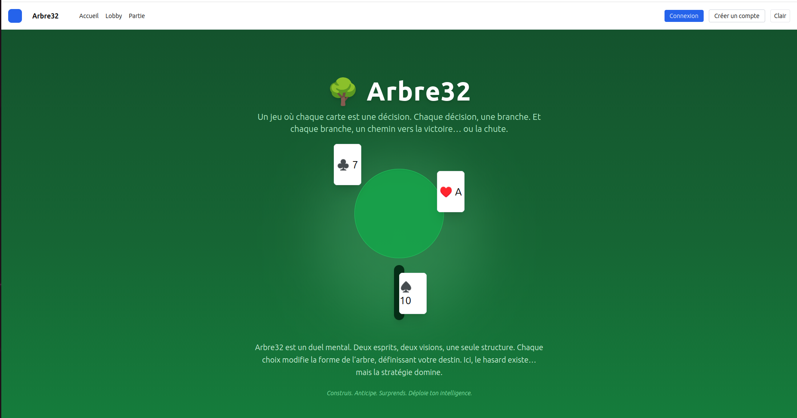
## CPATURES D'ECRAN
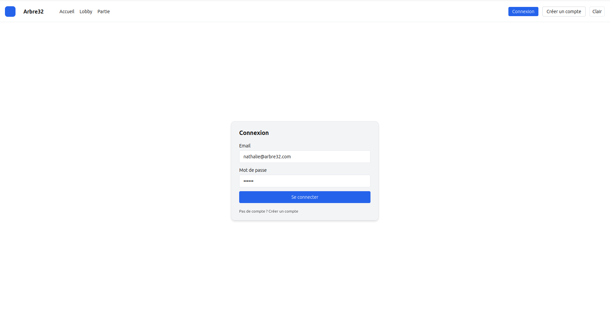
## CPATURES D'ECRAN
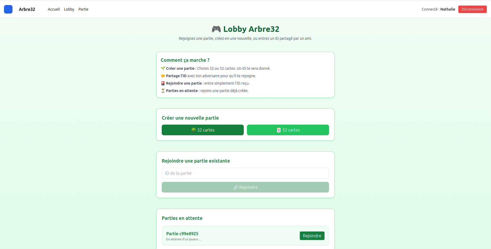
## CPATURES D'ECRAN

## CPATURES D'ECRAN
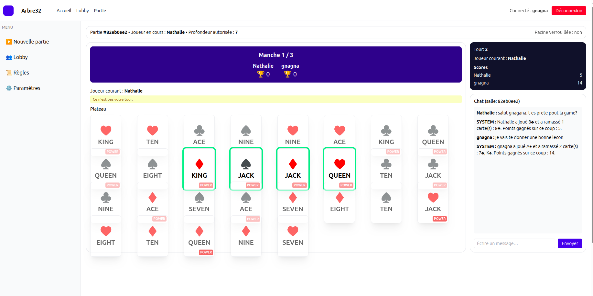
## CPATURES D'ECRAN
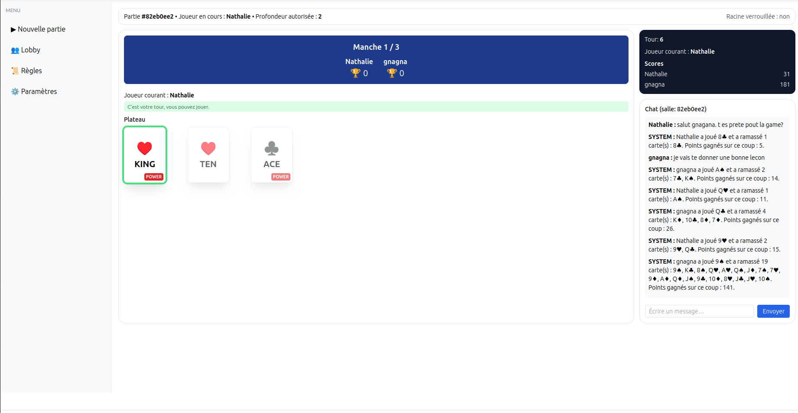
## CPATURES D'ECRAN
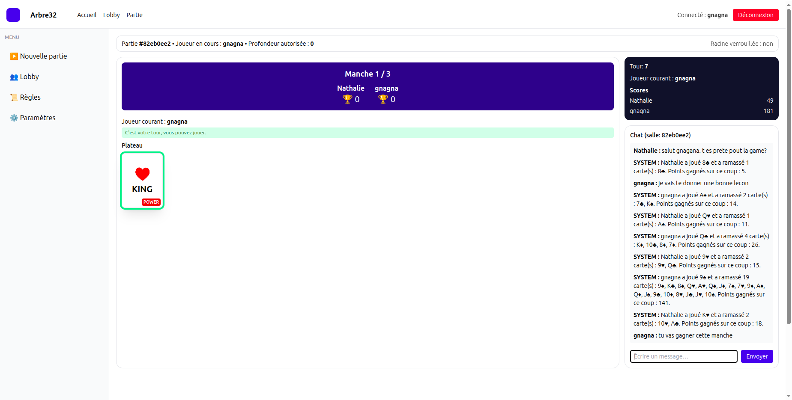
## CPATURES D'ECRAN
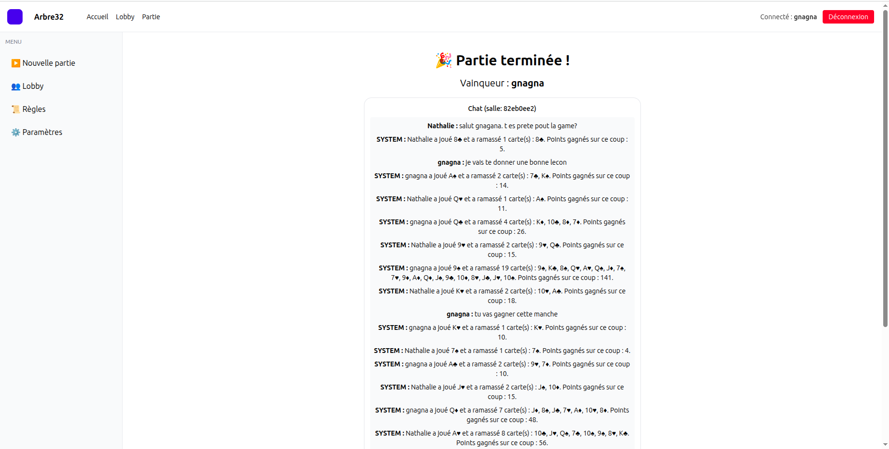
## CPATURES D'ECRAN
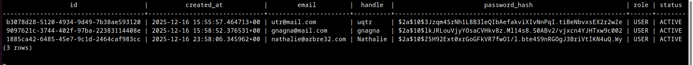
## CPATURES D'ECRAN
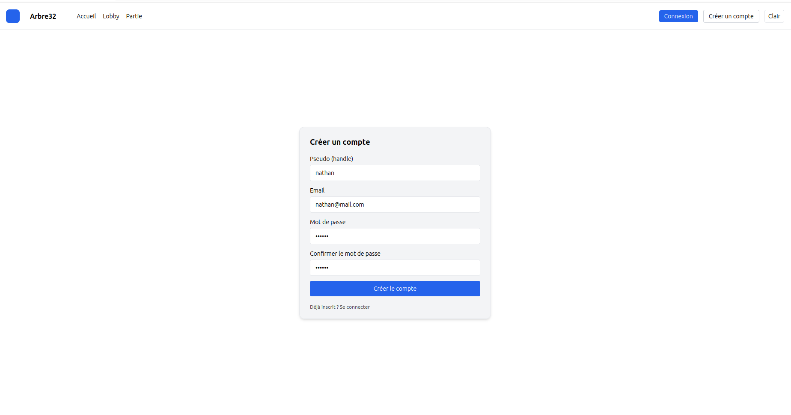
## CPATURES D'ECRAN
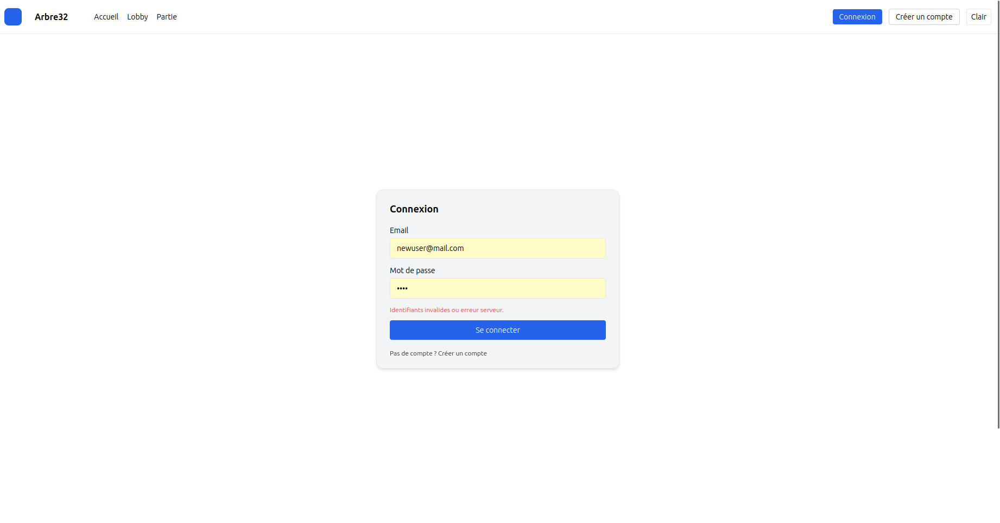